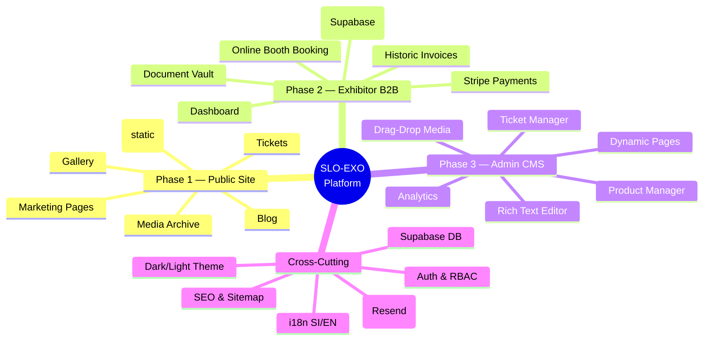
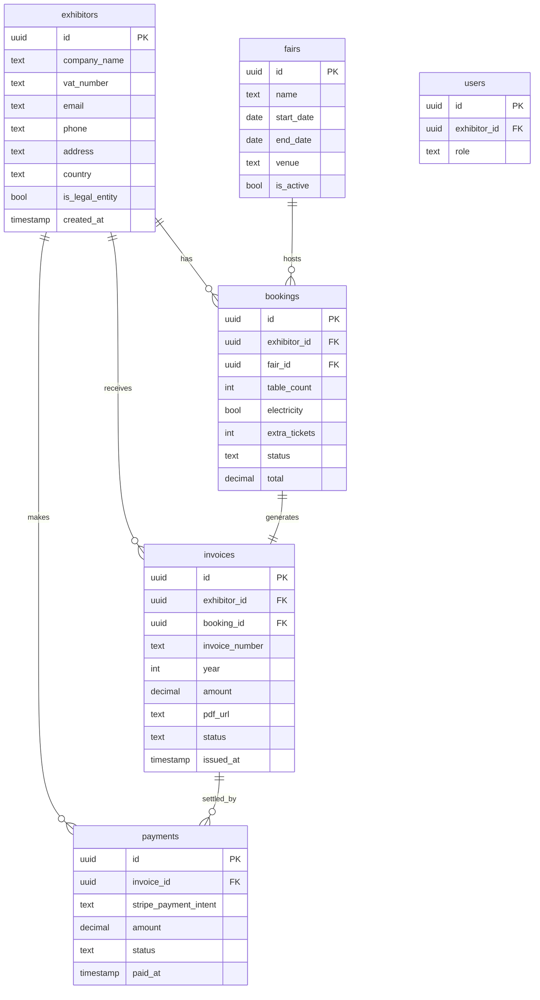
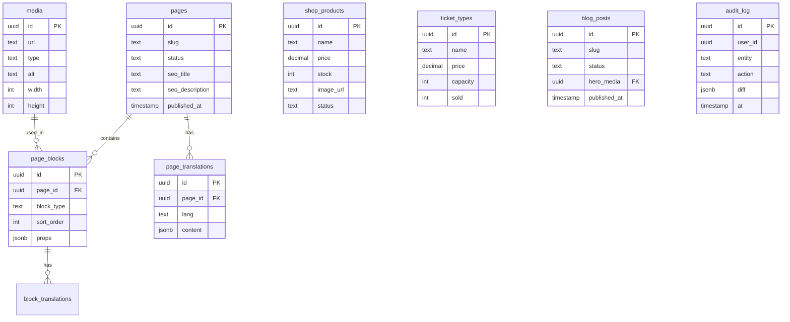
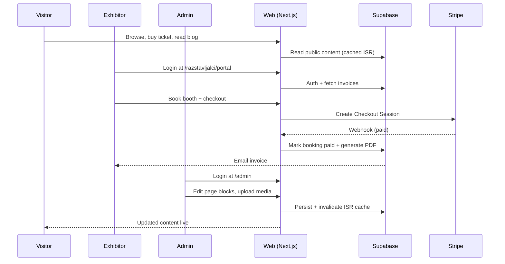

# SLO-EXO Platform — Project Mindmap

> Comprehensive visual blueprint of the SLO-EXO web platform across **Phase 1 (current)**, **Phase 2 (exhibitor portal)**, and **Phase 3 (admin CMS)**.
> Render this in any Markdown viewer that supports Mermaid (GitHub, VS Code, Obsidian, etc.).

---

## 1. High-Level Architecture (3 Phases)



---

## 2. Phase 1 — Current Public Site (Implemented)

```mermaid
graph TD
  Root[app/layout.tsx<br/>Root Layout] --> Header[Header.tsx<br/>Nav + i18n + Theme]
  Root --> Footer[Footer.tsx]
  Root --> CookieBanner
  Root --> FloatingContact

  Root --> Home[/page.tsx — Home/]
  Home --> HeroSection
  Home --> CountdownTimer
  Home --> AnimalCategoryGrid
  Home --> AboutStrip
  Home --> SponsorStrip
  Home --> SocialCTA

  Root --> Pages{Routes}
  Pages --> Visitors[/obiskovalci/]
  Pages --> Exhibitors[/razstavljalci/]
  Exhibitors --> Reg[/razstavljalci/prijava/]
  Exhibitors --> List[/razstavljalci/seznam/]
  Pages --> Tickets[/vstopnice/]
  Pages --> Gallery[/galerija/]
  Pages --> Blog[/blog/]
  Blog --> B1[/blog/terarij-za-zacetnike/]
  Blog --> B2[/blog/kako-izbrati-prvo-kaco/]
  Pages --> Shop[/trgovina/]
  Pages --> About[/o-nas/]
  Pages --> Sponsors[/pokrovitelji/]
  Pages --> Media[/za-medije/]
  Media --> Archive[/za-medije/arhiv/]
  Pages --> Contact[/kontakt/]
  Pages --> FAQ[/pogosta-vprasanja/]
  Pages --> Legal[/pravni-pouk/]

  Pages --> Cats{Animal Categories}
  Cats --> Plazilci[/plazilci/]
  Cats --> Dvozivke[/dvozivke/]
  Cats --> Pajkovci[/pajkovci/]
  Cats --> Glodavci[/glodavci/]
  Cats --> Zuzelke[/zuzelke/]
  Cats --> Ribe[/ribe-in-rastline/]
  Cats --> Rastline[/egzoticne-rastline/]
  Cats --> ZivaHrana[/ziva-hrana/]
  Cats --> Oprema[/oprema/]
  Cats --> Dodatno[/dodatno/]

  Root --> Lib[(lib/)]
  Lib --> i18n[i18n<br/>SI/EN translations]
  Lib --> Theme[theme<br/>dark/light]
  Lib --> Utils[utils.ts]

  Root --> UI[(components/ui/<br/>shadcn primitives)]
  UI --> btn[Button, Card, Dialog,<br/>Sheet, Accordion, Input,<br/>Select, Checkbox, Toast]
```



### Tech Stack (Phase 1)
- **Framework:** Next.js 15 (App Router, `trailingSlash`)
- **UI:** React 19, Tailwind CSS, shadcn/ui (Radix primitives)
- **Animation:** Framer Motion
- **Icons:** Lucide React
- **i18n:** Custom context (`si` / `en`)
- **Hosting:** Netlify

---

## 3. Phase 2 — Exhibitor B2B Portal (Planned)

```mermaid
graph LR
  subgraph Public
    Login[/razstavljalci/prijava/<br/>Login + Register]
  end

  subgraph Auth
    SB[Supabase Auth<br/>email magic-link + password]
  end

  subgraph Portal["/razstavljalci/portal/* (protected)"]
    Dash[Dashboard<br/>upcoming fair status]
    Profile[Company Profile<br/>VAT, address, contact]
    Booth[Book a Booth<br/>table + electricity + extras]
    Invoices[Invoices Archive<br/>2010-2025 historic + new]
    Docs[Documents<br/>CITES, transport, FURS]
    Pay[Payments<br/>Stripe Checkout + Portal]
    Messages[Messages with Organizer]
  end

  subgraph Backend
    DB[(Supabase Postgres)]
    Storage[(Supabase Storage<br/>invoices PDFs, logos)]
    Stripe[Stripe API]
    PDF[PDF generator<br/>react-pdf or pdfkit]
    Email[Resend / Postmark<br/>transactional]
  end

  Login --> SB
  SB --> Portal
  Portal --> DB
  Portal --> Storage
  Pay --> Stripe
  Stripe -->|webhook| DB
  DB --> PDF --> Storage
  DB --> Email
```

### Database Schema (proposed)



### Phase 2 Features
- **Historic data import:** CSV/SQL migration of past exhibitor records + invoices into `exhibitors` and `invoices` tables; PDFs uploaded to Supabase Storage.
- **Self-service onboarding:** Existing exhibitors claim their account via email-match magic link.
- **Online booking flow:** Wizard → review → Stripe Checkout → invoice auto-generated and emailed.
- **Stripe integration:** Checkout for one-off, optional Customer Portal for refunds/disputes.
- **Document vault:** Historic invoices + tax/transport documents downloadable as PDFs.
- **Notifications:** Email confirmations, payment receipts, fair reminders.
- **Multilingual:** SI/EN forms and invoice templates.

---

## 4. Phase 3 — Admin CMS (Planned)

```mermaid
graph TD
  Admin[/admin/* protected by RBAC] --> AD[Dashboard<br/>KPIs: ticket sales, exhibitors, revenue]
  Admin --> Pages[Page Builder<br/>create/edit any subpage]
  Admin --> Blocks[Block Library<br/>hero, gallery, text, CTA, faq, pricing]
  Admin --> RTE[Rich Text Editor<br/>Tiptap or Novel]
  Admin --> Media[Media Library<br/>drag-drop upload<br/>auto WebP/AVIF<br/>image cropper]
  Admin --> Shop[Product Manager<br/>add/edit/disable products]
  Admin --> Tix[Ticket Manager<br/>types, prices, capacity]
  Admin --> Blog[Blog Manager<br/>posts, categories, tags]
  Admin --> Sponsors[Sponsor Manager]
  Admin --> Cats[Animal Categories<br/>edit content per category]
  Admin --> i18nAdmin[Translations editor<br/>edit SI/EN side-by-side]
  Admin --> Users[User & Role Management]
  Admin --> Settings[Site Settings<br/>SEO, contact, hero, theme]
  Admin --> Audit[Audit Log<br/>who changed what when]

  RTE --> SBStorage[(Supabase Storage)]
  Media --> SBStorage
  Pages --> DB[(Supabase Postgres<br/>pages table with JSONB blocks)]
  Blocks --> DB
```

### CMS Data Model



---

## 5. End-to-End Data Flow



---

## 6. Suggested Additional Features (to dominate the region)

### A. User-facing growth
- **Live chat / WhatsApp widget** — instant questions during fair week.
- **AR/3D animal previews** on category pages (model-viewer).
- **"My favorites" wishlist** for shop and booth listings (persisted via localStorage + optional account).
- **Push notifications** (web push) for fair countdown, ticket releases, new sponsor announcements.
- **Loyalty / repeat-visitor discount codes** — automatic 10% for past attendees.
- **QR-coded tickets** sent via email; scanned at fair entrance.
- **Ticket bundles** — family pass, photographer pass, group/school discounts.
- **Calendar integration** (Add to Google/Apple Calendar) on event pages.
- **Interactive floor plan** — clickable booth map showing which exhibitor is where (live data from Phase 2).
- **"Meet the exhibitors"** profiles with photos, species list, social links.
- **Speaker / workshop schedule** — optional Phase 1.5 add-on if you start running talks.
- **Newsletter segmentation** — per interest (reptiles, plants, equipment).
- **User reviews / testimonials** carousel.
- **Photo contest** — user uploads photos from fair, vote for favorites.
- **Volunteer signup form**.

### B. SEO & content
- **Structured data (JSON-LD)**: Event, Organization, Article, Product schemas.
- **OG image generator** per page (Next.js OG API route).
- **Breadcrumbs everywhere**.
- **Reading time + estimated date** on blog.
- **Hreflang tags** for SI/EN (already partially via i18n).
- **Sitemap.xml split** by content type.
- **RSS feed** for blog and press.

### C. Accessibility & performance
- **WCAG AAA pass** (color contrast, focus rings, skip links).
- **Lighthouse CI** in deploy pipeline (target ≥95 across the board).
- **Image optimization** — switch all `` to Next `<Image>` for AVIF/WebP, blurred placeholders.
- **Reduced motion** preference respected.
- **Keyboard navigation tested** end-to-end.

### D. Trust & legal
- **Cookie consent** (already present) → upgrade to category-based with explicit Stripe/analytics opt-in.
- **GDPR data export & delete** self-serve in exhibitor portal.
- **Terms of Service + Privacy Policy** in both languages, versioned.
- **2FA** for admin and exhibitor accounts.

### E. Marketing & analytics
- **Plausible or Umami** (privacy-friendly) instead of GA4.
- **UTM tracking** on every CTA.
- **A/B testing harness** (Vercel/Netlify Edge).
- **Email drip campaigns** for ticket buyers (pre-fair tips, post-fair photos).
- **Affiliate / referral program** for exhibitors who bring new exhibitors.

### F. Community
- **Discord/Telegram link** for the Slovenian exotic-pet community.
- **Forum or Q&A** — could integrate Discourse or build minimal in-house.
- **Annual photo gallery contest with prizes**.
- **Educational content hub** — partner with vets, biologists for original articles.

---

## 7. Tech Decisions to Make

| Topic | Recommendation | Why |
|---|---|---|
| Backend | **Supabase** | Postgres + Auth + Storage + Realtime + RLS in one place |
| Payments | **Stripe** | Best DX, EU-friendly, supports invoices |
| PDF generation | **react-pdf** (server) | React-based, easy templating |
| Email | **Resend** | Modern API, generous free tier, React Email templates |
| RTE | **Tiptap** + Novel UI | Modern, extensible, AI-ready |
| Image CDN | **Supabase Storage + Next/Image** | Or Cloudinary if heavy media |
| Search | **Algolia** or pg_trgm/Postgres FTS | Algolia for snappy UX |
| Analytics | **Plausible** | Privacy-first, simple |
| Forms backend | **Resend + Supabase** | Custom; or Formspree for simple cases |
| Monitoring | **Sentry** | Error tracking |
| CI/CD | **GitHub Actions → Netlify** | Already on Netlify |

---

## 8. Phase Roadmap (suggested timeline)

```mermaid
gantt
    title SLO-EXO Roadmap — 3-Week Sprint (May 18 – June 8)
    dateFormat  YYYY-MM-DD
    section Phase 1 — LIVE
    Public site & blog/gallery/tickets/media :done, p1, 2025-10-01, 2026-05-18
    section Phase 1.5 — Polishing (Week 1)
    Final design QA + banner fixes         :crit, p1x, 2026-05-18, 5d
    Copy refinement + translation gaps     :p1y, after p1x, 3d
    Performance & Lighthouse pass          :p1z, after p1x, 3d
    section Phase 2 — Exhibitor Portal (Weeks 2-3)
    Supabase + Auth scaffolding            :crit, p2a, 2026-05-25, 4d
    Historic data import + PDF vault       :p2b, after p2a, 5d
    Portal dashboard + invoice viewer      :p2c, after p2a, 6d
    Stripe checkout + booking flow         :p2d, after p2c, 5d
    Beta with 5 exhibitors                 :milestone, p2e, 2026-06-08
    section Phase 3 — Admin CMS (Q3 2026)
    CMS scaffolding                        :p3a, 2026-07-01, 14d
    Page builder + media library           :p3b, after p3a, 21d
    Shop + ticket manager                  :p3c, after p3b, 14d
    Dynamic migration + launch             :milestone, p3d, 2026-09-15
    section Continuous
    A11y + SEO + analytics                 :p4a, 2026-06-08, 2026-09-15
```

---

## 9. Repo Folder Targets (post Phase 2/3)

```
src/
├── app/
│   ├── (public)/              ← current marketing site
│   ├── razstavljalci/portal/  ← NEW Phase 2 protected area
│   │   ├── dashboard/
│   │   ├── invoices/
│   │   ├── booth/
│   │   └── settings/
│   ├── admin/                 ← NEW Phase 3 CMS
│   │   ├── pages/
│   │   ├── media/
│   │   ├── shop/
│   │   ├── tickets/
│   │   └── users/
│   └── api/
│       ├── stripe/webhook/
│       ├── invoices/[id]/pdf/
│       └── auth/
├── components/
│   ├── ui/                    ← shadcn (existing)
│   ├── sections/              ← marketing blocks (existing)
│   ├── portal/                ← NEW exhibitor UI
│   ├── admin/                 ← NEW CMS UI
│   └── blocks/                ← NEW dynamic page blocks
├── lib/
│   ├── i18n/
│   ├── theme/
│   ├── supabase/              ← NEW client + server helpers
│   ├── stripe/                ← NEW
│   └── pdf/                   ← NEW invoice templates
└── db/
    └── migrations/            ← NEW Supabase migrations
```

---

## 10. Open Questions to Decide Before Phase 2

1. **Auth method:** magic-link only, or also password? (recommend both)
2. **Invoice numbering continuity:** keep historic numbering scheme or restart?
3. **VAT handling:** SLO-EXO charges Slovenian VAT? Reverse-charge for EU companies?
4. **Refund policy:** automated or manual via admin?
5. **Booth allocation:** first-come-first-served, or admin assigns after request?
6. **Multi-currency?** EUR only, or also accept other?
7. **Historic invoice PDFs:** do you have them all digitized, or do we need to scan?
8. **Single fair per year, or multiple cities?** Schema is ready for many.

---

*Last updated: 2026-05-18 — Phase 1 deployed, awaiting Phase 2 kickoff.*
