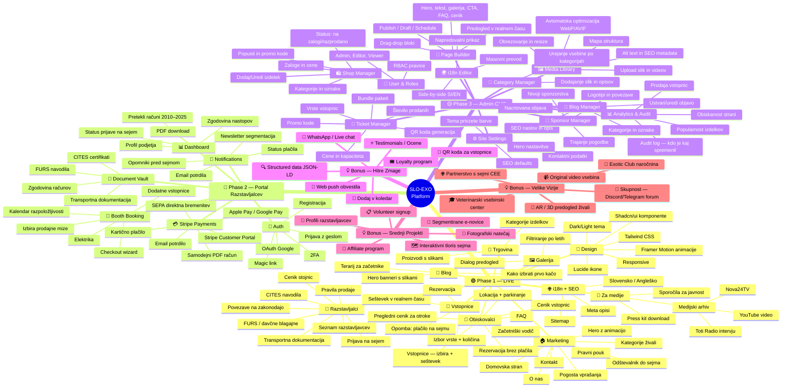

# SLO-EXO — Complete Platform Mindmap

> Open this file in any Mermaid viewer (VS Code, GitHub, Obsidian, Mermaid Live Editor) to see the interactive mindmap.
> **Current features** ✅ | **Phase 2** 🔐 | **Phase 3** ⚙️ | **Bonus ideas** 💡



---

## Kako uporabljati

1. **VS Code** — Namestite razširitev *"Markdown Preview Mermaid Support"*, odprite ta file, pritisnite `Ctrl+Shift+V` (ali `Cmd+Shift+V` na Macu).
2. **GitHub** — Naložite na GitHub. Mermaid diagram se avtomatsko renderira.
3. **Obsidian** — Vključite Mermaid plugin, diagram se prikaže avtomatsko.
4. **Mermaid Live Editor** — Kopirajte samo vsebino med 
```mermaid in 
``` na https://mermaid.live

## Legenda

- 🟢 **Phase 1** — Že implementirano in objavljeno
- 🔵 **Phase 2** — Junij 2026 — B2B portal za razstavljalce
- 🟡 **Phase 3** — Q3 2026 — Admin CMS za samostojno upravljanje
- 💡 **Bonus** — Ideje za hitro ali dolgoročno implementacijo
