# SLO-EXO - Complete Platform Mindmap

> Open in VS Code with "Markdown Preview Mermaid Support" or at https://mermaid.live

```mermaid
mindmap
  root((SLO-EXO Platform))
    Phase 1 LIVE
      Marketing
        Homepage with hero animation
        Countdown timer to fair
        Animal categories grid
        About us page
        Contact page
        Legal info
        FAQ accordion
      Visitors
        Ticket pricing
        Ticket selection + summary
        Reservation without payment
        Kids pricing
        First timer guide
        Location and parking
        Visitor FAQ
      Exhibitors
        Booth pricing table
        Animal sales rules
        CITES guidelines
        FURS tax register info
        Transport documents
        Legislation links
        Registration form
        Exhibitor list
      Blog
        Terrarium for beginners
        How to choose first snake
        Hero banners with images
      Gallery
        Filter by year
        Lightbox preview
      Tickets
        Type selection + quantity
        Real-time price summary
        Reservation form
        Payment at fair note
      Shop
        Product categories
        Product cards with images
      Media
        Press kit download
        Press releases
        Media archive
          Nova24TV article
          YouTube video
          Toti Radio interview
      i18n and SEO
        Slovenian and English
        Sitemap
        Meta descriptions
      Design System
        Dark and light theme
        Tailwind CSS
        Framer Motion animations
        Fully responsive
        Shadcn UI components
        Lucide icons
    Phase 2 B2B Portal
      Authentication
        Registration
        Password login
        Magic link login
        Google OAuth
        Two-factor auth
      Dashboard
        Registration status for fair
        History of past fairs
        Historic invoices 2010 to 2025
        PDF download
        Company profile
      Booth Booking
        Table selection
        Electricity option
        Extra tickets
        Availability calendar
        Checkout wizard
      Stripe Payments
        Credit card payment
        Apple Pay and Google Pay
        SEPA direct debit
        Auto-generated PDF invoice
        Email confirmation
        Stripe Customer Portal
      Notifications
        Email confirmations
        Fair reminders
        Payment status updates
        Segmented newsletters
      Document Vault
        CITES certificates
        Transport documentation
        FURS guidelines
        Invoice history
    Phase 3 Admin CMS
      Page Builder
        Drag and drop blocks
        Hero, text, gallery, CTA, FAQ, pricing
        Real-time preview
        Publish, draft, schedule
      Media Library
        Image and video upload
        Auto WebP and AVIF optimization
        Crop and resize
        Alt text and SEO metadata
        Folder structure
      Shop Manager
        Add and edit products
        Stock and prices
        Categories and tags
        Discounts and promo codes
        In stock and sold out status
      Ticket Manager
        Ticket types
        Prices and capacity
        Sold count
        Promo codes
        Bundle packages
        QR code generation
      Blog Manager
        Create and edit posts
        Categories and tags
        SEO title and description
        Scheduled publishing
      Sponsor Manager
        Logos and links
        Sponsorship tiers
        Contract duration
      Category Manager
        Edit content per animal category
        Add images and descriptions
      i18n Editor
        Side by side SI and EN
        Bulk translation
        Progress view
      Users and Roles
        Admin, Editor, Viewer roles
        RBAC permissions
      Site Settings
        SEO defaults
        Contact info
        Hero settings
        Default theme colors
      Analytics and Audit
        Ticket sales reports
        Page visit stats
        Product popularity
        Audit log of all changes
    Bonus Quick Wins
      QR code tickets
      Add to calendar button
      WhatsApp live chat
      Structured data for Google
      Web push notifications
      Loyalty discount program
      User reviews and testimonials
    Bonus Medium Projects
      Interactive fair floor plan
      Exhibitor public profiles
      Photo contest with voting
      Segmented email newsletters
      Affiliate referral program
      Volunteer signup form
    Bonus Big Visions
      AR 3D animal preview
      Exotic Club subscription
      Vet and biology content hub
      CEE fair partnerships
      Original video content
      Community Discord or forum
```

---

## How to view

1. **VS Code**: Install "Markdown Preview Mermaid Support" extension, open this file, press `Ctrl+Shift+V`
2. **GitHub**: Upload to repo - renders natively
3. **Mermaid Live**: Copy the code between the triple backticks to https://mermaid.live

## Legend

- **Phase 1** - Already implemented and live
- **Phase 2** - June 2026 - Exhibitor B2B portal
- **Phase 3** - Q3 2026 - Admin CMS
- **Bonus** - Ideas for quick or long-term implementation
